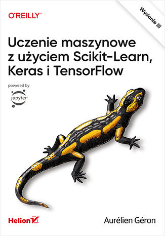
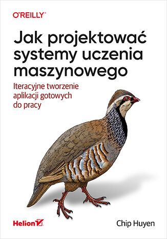

# analiza-danych-2025-03-24

# https://www.kaggle.com/learn

# https://miroslawmamczur.pl/blog/

## Polecane książki :)

(https://libgen.is/)

- Data science od podstaw. Analiza danych w Pythonie. Wydanie II

- Python w analizie danych. Przetwarzanie danych za pomocą pakietów Pandas i NumPy oraz środowiska IPython. Wydanie II

- Statystyka praktyczna w data science. 50 kluczowych zagadnień w językach R i Python. Wydanie II

### MACHINE LEARNING

Polecane książki:

- Uczenie maszynowe z użyciem Scikit-Learn, Keras i TensorFlow. Wydanie III

- Data science od podstaw. Analiza danych w Pythonie. Wydanie II

- Python w analizie danych. Przetwarzanie danych za pomocą pakietów Pandas i NumPy oraz środowiska IPython. Wydanie II

- Statystyka praktyczna w data science. 50 kluczowych zagadnień w językach R i Python. Wydanie II

- Jak projektować systemy uczenia maszynowego. Iteracyjne tworzenie aplikacji gotowych do pracy

kontakt do mnie: tomasz.wilinski97@gmail.com
